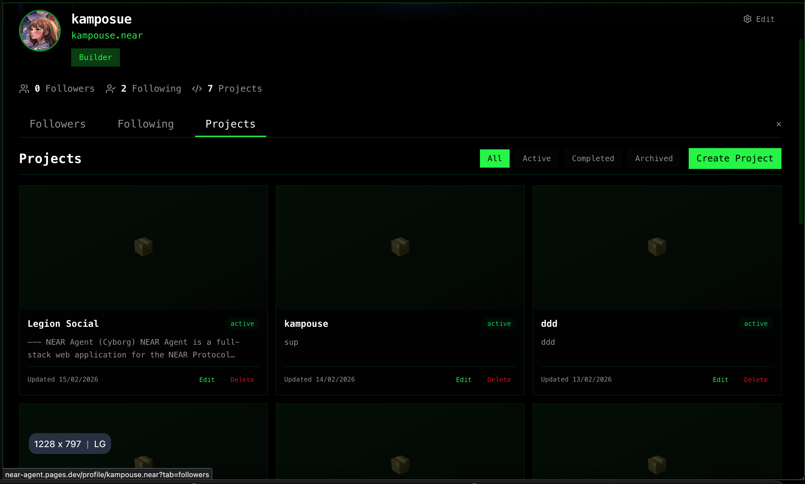
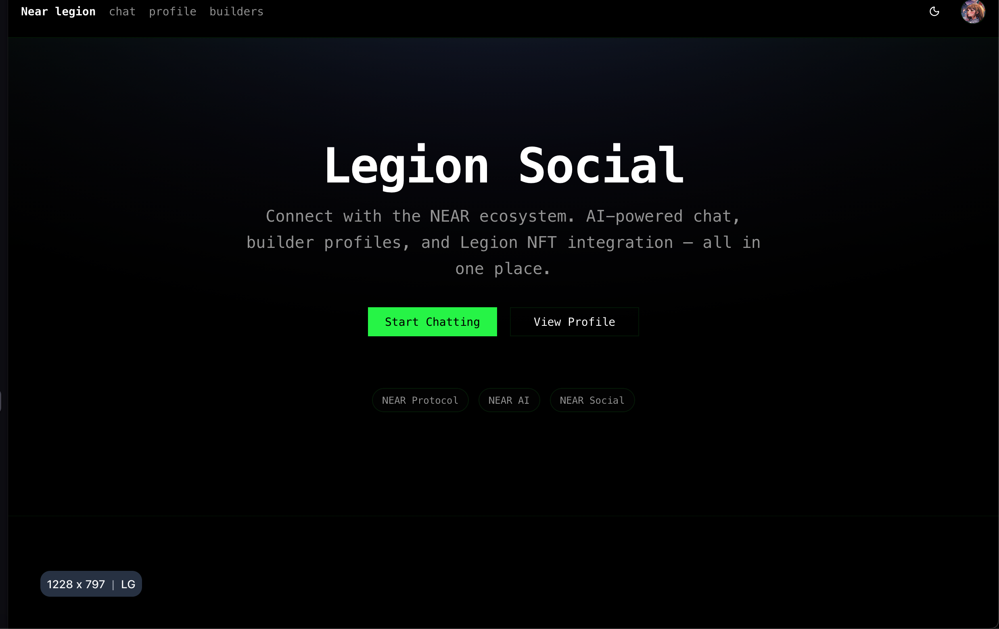
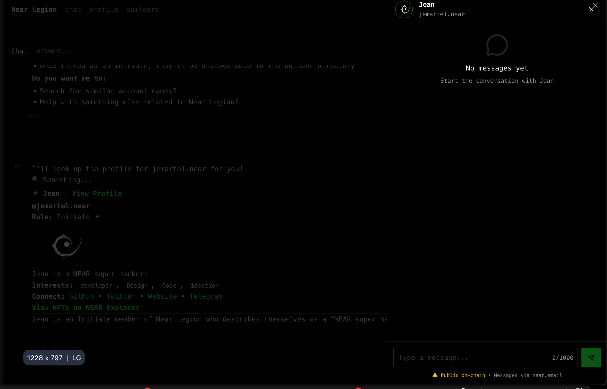
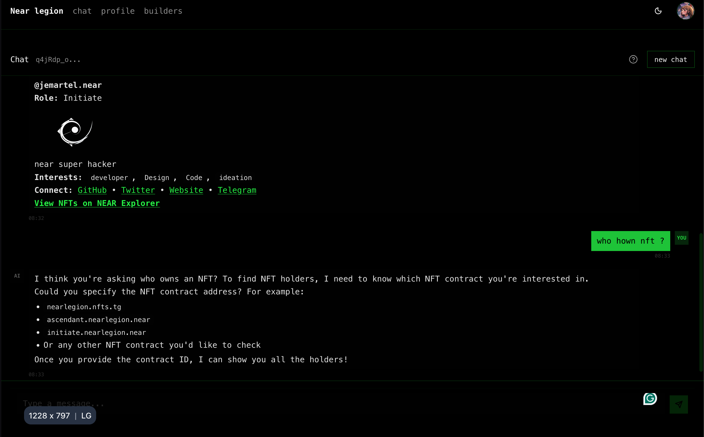
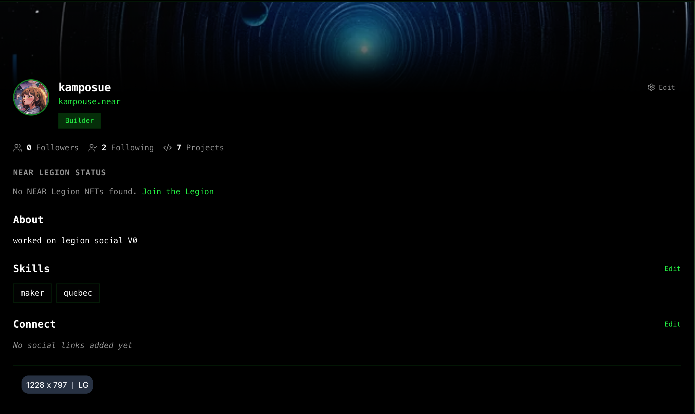
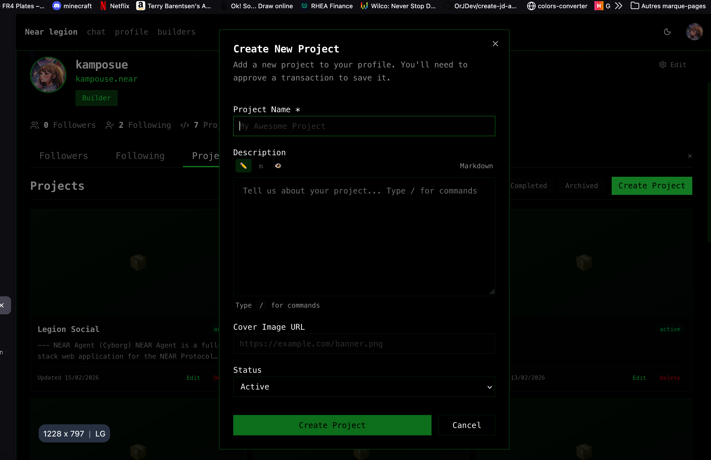

# Cyborg: AI-Powered Social Hub for NEAR Builders

A privacy-preserving social platform that combines decentralized AI, NFT-based reputation, and gasless social interactions—built for the NEAR ecosystem.

**Live Demo:** [cyborg.pages.dev](https://cyborg.pages.dev)

---

## 🎯 What It Does

Cyborg is a social platform for NEAR ecosystem builders that solves three core problems:

1. **High Friction Social Interactions** - Every follow/unfollow requires wallet signing and gas fees
2. **No Central Builder Directory** - Hard to discover and connect with other NEAR developers
3. **AI Not Integrated Into Workflow** - AI tools exist but aren't connected to the development experience

---

## ✨ Key Features

### 🤖 AI Chat with NEAR AI Cloud

- **Streaming responses** from GLM-4.6 model via NEAR AI Cloud
- **Persistent conversation history** - never lose context
- **No API keys needed** - platform handles authentication
- **NEAR-aware** - trained on NEAR ecosystem documentation
- **Tool calling** - AI can query and interact with your application data

**Use case:** Ask questions about NEAR development, get code help, brainstorm ideas.

### 👥 Builder Discovery & Profiles

- **Browse NEAR Legion NFT holders** - discover who's building in the ecosystem
- **View builder profiles** with projects, skills, and social links
- **NFT-based reputation badges** (Legendary, Epic, Rare, Common)
- **Profile data stored on NEAR Social** blockchain

**Use case:** Find collaborators, explore projects, see who holds NEAR Legion NFTs.

### 🔒 Privacy-Preserving Payment Keys

> **⚠️ PROOF OF CONCEPT** - This feature is currently in active development and should be considered experimental. Use at your own risk.
being able to edit profile and project without having to  sign transaction using outlayer with contextual.near  


### 📁 Project Management



- **Create and showcase projects** with cover images, descriptions, and status
- **Store on-chain via FastData** protocol (contextual.near)
- **Status tracking** - mark projects as active, completed, or archived
- **Optional payment key fast path** - update projects instantly without signing

**Use case:** Build your portfolio and show off your work to the community.

### 🌐 Social Graph Integration

- **Follow/unfollow** other builders
- **FastData protocol** integration for scalable social graph indexing
- **Payment key execution** for instant follows (optional)
- **Follower/following counts** with real-time updates

**Use case:** Build your network and stay updated with builders you follow.

---

## 🏗️ How It Works

### Architecture Overview

```
┌─────────────────────────────────────────────────────────────┐
│                    Cyborg Architecture                       │
├─────────────────────────────────────────────────────────────┤
│                                                               │
│  ┌──────────────────┐         ┌──────────────────┐         │
│  │   Frontend       │         │   Payment Keys   │         │
│  │   React 19       │         │   Client-Side    │         │
│  │   TanStack       │◄────────┤   Encryption     │         │
│  │   Router         │         │   (AES-GCM)      │         │
│  └────────┬─────────┘         └──────────────────┘         │
│           │                                                      │
│           ▼                                                      │
│  ┌─────────────────────────────────────────────────────────┐   │
│  │   API Routes (Hono.js)                                  │   │
│  │                                                          │   │
│  │  /chat/*           → AI chat streaming                  │   │
│  │  /builders/*       → Builder directory                  │   │
│  │  /projects/*       → Project CRUD                       │   │
│  │  /social/*         → Follow/following                   │   │
│  │  /payment-keys/*   → Gasless execution                  │   │
│  └─────────────────────────────────────────────────────────┘   │
│           │                                                      │
│           ▼                                                      │
│  ┌─────────────────────────────────────────────────────────┐   │
│  │   Services & Integrations                               │   │
│  │                                                          │   │
│  │  NEAR AI Cloud (GLM-4.6)                                    │   │
│  │  NEAR Social (profiles)                                 │   │
│  │  NEARBlocks API (NFT data)                              │   │
│  │  FastData (social graph + projects)                     │   │
│  │  OutLayer (payment key execution)                       │   │
│  │  D1 Database (SQLite)                                   │   │
│  └─────────────────────────────────────────────────────────┘   │
│                                                               │
└─────────────────────────────────────────────────────────────┘
```

### Data Flow

**AI Chat:**
1. User sends message → API
2. API streams response from NEAR AI Cloud
3. Conversation saved to database

**Builder Directory:**
1. Fetch user user from database from indexed data 
2. Fetch profiles from NEAR Social blockchain
3. Display with NFT rank badges 

**Projects:**
1. Create/update → prepare transaction for FastData contract
2. If payment key exists → execute instantly (fast path)
3. Otherwise → user signs with wallet (default path)

---

## 🛠️ Developer Tools & Infrastructure

### RPC Load Balancing

This project uses **[near-balancer](https://github.com/Kampouse/near-balancer)** for intelligent RPC request distribution:

- **Round-robin rotation** across multiple NEAR RPC endpoints
- **Automatic retry logic** for failed requests
- **Reduced rate limiting** by distributing load
- **Improved reliability** with fallback endpoints

**Philosophy:** *"Don't fight RPC, use them"* - balance requests across multiple nodes instead of relying on a single endpoint.

### Data Sync Scripts (`/worker/scripts`)

Comprehensive tooling for syncing NEAR blockchain data to D1 database for fast, cached queries:

**Sync Strategies:**
- `sync-simple.ts` - Reliable NFT holder sync with conservative defaults
- `sync-fast.ts` - Maximum throughput sync for quick updates
- `sync-profiles.ts` - NEAR Social profile caching with 24h TTL
- `sync-all.ts` - Combined sync of holders and profiles

**Features:**
- **Resumable syncs** - Progress saved to state files, safe to restart
- **Concurrent requests** - Parallel fetching with configurable limits
- **Endpoint rotation** - Distributes load across RPC nodes
- **Exponential backoff** - Handles rate limits gracefully
- **Batch database writes** - Optimized for D1 performance

**Performance Impact:**
```
Without Cache: Request → RPC → 200-500ms → Response
With Cache:    Request → D1  → 10-50ms   → Response
```

**10-50x faster** response times for cached data.

**Database Tables:**
- `legion_holders` - NFT holdings across multiple contracts
- `near_social_profiles` - Cached user profiles with extracted fields
- `legion_nft_images` - NFT metadata and image URLs

See [`/worker/scripts/README.md`](/worker/scripts/README.md) for detailed documentation and usage examples.

---

## 🎯 NEARCON Innovation Sandbox Alignment

### Decentralized AI ✅
- **NEAR AI Cloud integration** for private, secure AI conversations
- **Streaming responses** from GLM-4.6 model
- **NEAR-specific context** trained on ecosystem documentation
- **Platform authentication** - no API key exposure

### Privacy-Preserving Consumer Apps ✅
- **privacy on chain** (theory) have private profile on chain
- **Gasless interactions** - pre-authorized spending without signing
- **User-controlled data** stored on NEAR Social
- **FastKV protocol** integration for scalable data(cheap / fast)
---

## 🚀 Getting Started

### Prerequisites

```bash
# Install Bun
curl -fsSL https://bun.sh/install | bash
```

### Installation

```bash
# Clone and install
git clone https://github.com/NEARBuilders/cyborg.git
cd cyborg
bun install

# Run database migrations
bun db:migrate

# Start development
bun dev

yes about that..  current setup  only work deployed since i was always testing on the live app

```

### Environment Setup

Create `.env` file:

```bash
# Required
NEAR_AI_API_KEY=sk-xxx          # Get from https://cloud.near.ai

# Optional (with defaults)
BETTER_AUTH_URL=http://localhost:3001
NEAR_AI_BASE_URL=https://cloud-api.near.ai/v1
NEAR_AI_MODEL=glm/glm-4-plus
NEAR_RPC_URL=https://rpc.mainnet.near.org
```

---

## 📸 Screenshots

### Landing Page


Welcome page with feature overview and sign-in button.

### AI Chat Interface



Streaming chat with conversation history and markdown support.

### Builder Profiles


View builder details, NFT rank, projects, and social links.


Manage encrypted payment keys and view balances.

### Project Creation


Create projects with cover images and descriptions.

---

## 🛠️ Development

```bash
# Type checking
bun typecheck

# Run tests
bun test

# Build for production
bun build

# Database operations
bun db:push          # Push schema changes
bun db:studio        # Open Drizzle Studio
bun db:generate      # Generate migrations
```

---

## 🔧 What's Inside

### Frontend (`ui/`)
- **React 19** with TypeScript
- **TanStack Router** - file-based routing
- **TanStack Query** - server state management
- **Tailwind CSS v4** - styling
- **shadcn/ui** - component library

### Backend (`worker/`)
- **Hono.js** - web framework
- **Drizzle ORM** - database
- **D1 (SQLite)** - data storage
- **Better-Auth** - authentication
- **better-near-auth** - NEAR wallet integration

### Key Integrations
- **NEAR AI Cloud** - GLM-4.6 model
- **NEAR Social** - profile storage
- **NEARBlocks API** - NFT holder data
- **FastData** - social graph + projects
- **OutLayer** - payment key execution

---

## 📜 License

MIT

---

## 🙏 Acknowledgments

Built with innovative technologies from the NEAR ecosystem:
- [near.garden](https://near.garden)
- [near-kit](https://kit.near.tools) - NEAR Protocol SDK
- [better-near-auth](https://github.com/elliotBraem/better-near-auth) - NEAR authentication
- [NEAR AI Cloud](https://cloud.near.ai) - AI model hosting
- [NEAR Social](https://near.social) - Decentralized social graph

---

**Built for NEARCON 2026 Innovation Sandbox**

*Private. Intelligence. Yours.* 🌐
